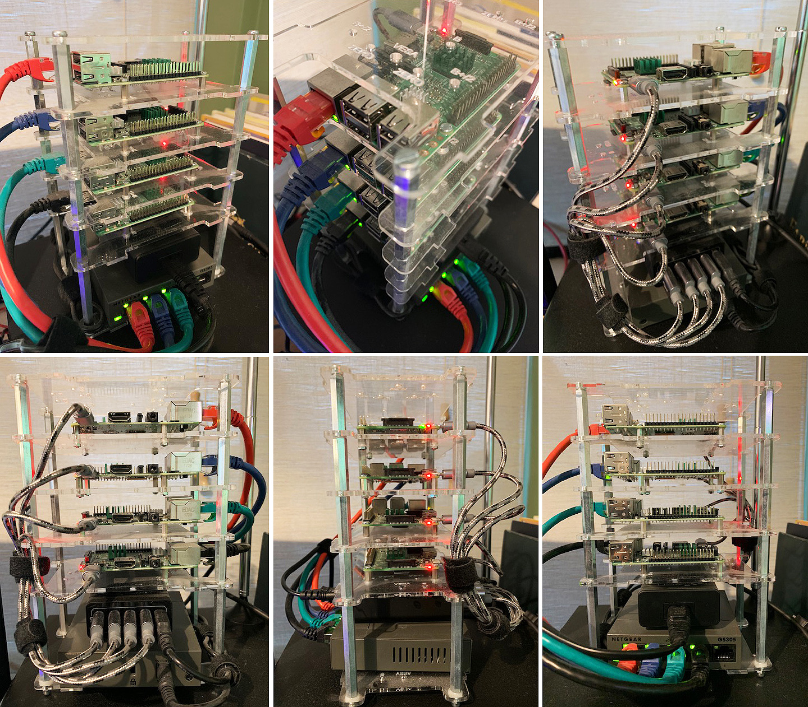

# Raspberry Pi Cluster Build

These are my notes and relevant yaml files for the setup of my Raspberry Pi cluster (4x Raspberry Pi 3 Model B's). Note these were last used for these versions of Kubernetes and Docker:

Kubernetes: 
```text
&version.Info{Major:"1", Minor:"13", GitVersion:"v1.13.2", GitCommit:"cff46ab41ff0bb44d8584413b598ad8360ec1def", GitTreeState:"clean", BuildDate:"2019-01-10T23:33:30Z", GoVersion:"go1.11.4", Compiler:"gc", Platform:"linux/arm"}
```

Docker:
```text
Docker version 18.09.0
```

## Raspberry Pi Cluster shopping list

* [Multi-Pi Stackable Raspberry Pi Case (x2)](https://www.modmypi.com/raspberry-pi/cases-183/raspberry-pi-b-plus2-and-3-cases-1122/stacking-cases-1132/multi-pi-stackable-raspberry-pi-case/?search=stackab) 
* [Raspberry Pi 3 Model B Quad Core CPU 1.2 GHz 1 GB RAM Motherboard (x4)](https://www.amazon.co.uk/gp/product/B01CD5VC92/ref=od_aui_detailpages00?ie=UTF8&psc=1)
* [SanDisk Ultra 32GB micro SDHC Memory Card + SD Adapter with A1 App Performance up to 98MB/s, Class 10, U1 - FFP (x3)](https://www.amazon.co.uk/gp/product/B073S8LQSL/ref=oh_aui_detailpage_o00_s00?ie=UTF8&psc=1)
* [SanDisk Ultra 64GB micro SDXC Memory Card + SD Adapter with A1 App Performance up to 100MB/s, Class 10, U1 - FFP (x1)](https://www.amazon.co.uk/gp/product/B073SB2L3C/ref=oh_aui_detailpage_o00_s00?ie=UTF8&psc=1)
* [Adaptare 40545 Charging Cable USB Type A Male to DC Barrel Jack (5.5 x 2.5 mm – 60 cm) (x1)](https://www.amazon.co.uk/gp/product/B01BHEAM9Q/ref=oh_aui_detailpage_o01_s00?ie=UTF8&psc=1)
* [VELCRO Brand Stick On Tape - 20 mm x 2.5 m, Black (x1)](https://www.amazon.co.uk/gp/product/B0013D8IUC/ref=oh_aui_detailpage_o02_s00?ie=UTF8&psc=1)
* [Gorilla Pi Heat-sink For Raspberry Pi 3 & Pi 2 Model B. 3Pc Set (x1 copper x2 aluminium) With Pre Installed Heat-sink Adhesive (x4)](https://www.amazon.co.uk/gp/product/B01FY9196K/ref=oh_aui_detailpage_o03_s00?ie=UTF8&psc=1)
* [NETGEAR GS305-100UKS 5-Port Gigabit Metal Ethernet Desktop/Wall-mount Switch (x1)](https://www.amazon.co.uk/gp/product/B00TV4A96Q/ref=oh_aui_detailpage_o04_s00?ie=UTF8&psc=1)
* [Anker USB Charger Power-Port 5 (40W 5-Port USB Charging Hub) Multi-Port Wall Charger (x1)](https://www.amazon.co.uk/gp/product/B00VTI8K9K/ref=oh_aui_detailpage_o04_s00?ie=UTF8&psc=1)
* [Micro USB Cable Ulreon 4 Pack Short 12 inch/0.3m High Speed Quick Charging Sync 2.4A Ultra Strong Durable Nylon Braided Cord (x1)](https://www.amazon.co.uk/gp/product/B074DVPLQP/ref=oh_aui_detailpage_o05_s00?ie=UTF8&psc=1)
* [Ethernet Cable, Rankie 5-Pack 0.3m RJ45 Cat 6 Ethernet Patch LAN Network Cable (5-Color Combo) - R1300A (x1)](https://www.amazon.co.uk/gp/product/B01J8KFTB2/ref=oh_aui_detailpage_o05_s00?ie=UTF8&psc=1)

## The final build


## Installing the OS
To flash the image to the SD card on Windows you can use [Etcher](https://www.balena.io/etcher/).

Use the latest Raspian Stretch Lite img [from here](https://downloads.raspberrypi.org/raspbian_lite_latest). The default user/password for Raspian is *pi/raspberry*.

You need to make a minor adjustment to the */boot/cmdline.txt* file to enable cgroup memory required by kubernetes, add the following options to the beginning:
```properties
cgroup_enable=memory cgroup_memory=1
```
Lower the swappiness - rather than completely removing the swap which is recommended for Kuberenetes, we only have 1Gb of RAM to play with. Edit */etc/sysctl.conf* and add:
```properties
vm.swappiness = 1
```
"1" means it will only use swap when RAM use exceeds 99%. 

Change the hostname to something appropriate (default is: *raspberrypi*) by editing */etc/hostname* and change *pi*'s default password using *passwd*. Install any useful tools you're used to (*vim* etc.).

Now is a good time to do an OS update:
```bash
sudo aptitude safe-upgrade
```

Note that Raspian doesn't seem to start the ssh server on start-up, use this to fix that:
```bash
sudo systemctl enable ssh.socket
```
Set up any niceties such as ssh keys for hopping between the nodes:
```bash
ssh-keygen -o -a 100 -t ed25519
```
## Docker installation
The commands below assume that your Raspian user is called *pi*
```bash
sudo curl -sSL https://get.docker.com | sh
sudo usermod -aG docker pi
```
## Master node networking set-up
We're using a private network with all RPis connected using *eth0* via the switch and one master node connected to the main network via *wlan0*. On the master node only we want to set up the wireless networking up as this will be how we get onto the RPi private network. Edit */etc/wpa_supplicant/wpa_supplicant.conf* and add your SSID and password like so:
```properties
ctrl_interface=DIR=/var/run/wpa_supplicant GROUP=netdev                                 
update_config=1
network={
    ssid="Information Retrieval"
    psk="xxxxxxxxxxxxx"  
}
``` 
Then restart:
```bash
sudo reboot
```
Running *ifconfig* you should see that *wlan0* has been assigned an IP from the main network.

### Set up the DHCP server (master node only)
First set up a static IP address for the cluster's internal network on the master node. Edit */etc/network/interfaces.d/eth0*:
```properties
allow-hotplug eth0
iface eth0 inet static
    address 10.0.0.1
    netmask 255.255.255.0
    broadcast 10.0.0.255
    gateway 10.0.0.1
```
Then restart:
```bash
sudo reboot
```

The master node will now be 10.0.0.1 on the internal network. 
Next we need to install DHCP on this master node so it will allocate IP addresses to the worker nodes. Run:
```bash
apt-get install isc-dhcp-server
```
Then configure the DHCP as follows in */etc/dhcp/dhcpd.conf*
```properties
# Set a domain name, can basically be anything
option domain-name "magnum.home";
option domain-name-servers 8.8.8.8, 8.8.4.4;
# We'll use 10.0.0.X for our subnet
subnet 10.0.0.0 netmask 255.255.255.0 {
    range 10.0.0.1 10.0.0.10;
    option subnet-mask 255.255.255.0;
    option broadcast-address 10.0.0.255;
    option routers 10.0.0.1;
}
default-lease-time 600;
max-lease-time 7200;
authoritative;
```
Then add *eth0* as the interface to run DHCP on, edit */etc/default/isc-dhcp-server* and add "eth0" to the ipv4 interfaces list:
```properties
# On what interfaces should the DHCP server (dhcpd) serve DHCP requests?
# Separate multiple interfaces with spaces, e.g. "eth0 eth1".
INTERFACESv4="eth0"
INTERFACESv6="" 
```
Then restart:
```bash
sudo reboot
```
Now the master node should be handing out IP addresses. 

### Private to main network routing (master node only)
The final step in setting up networking on the master node is setting up network address translation (NAT) so that the internal network can reach the main network. Edit */etc/rc.local* (or equivilent) and add *iptables* rules for forwarding *eth0* to *wlan0* and back.
```bash
iptables -t nat -A POSTROUTING -o wlan0 -j MASQUERADE
iptables -A FORWARD -i wlan0 -o eth0 -m state --state RELATED,ESTABLISHED -j ACCEPT
iptables -A FORWARD -i eth0 -o wlan0 -j ACCEPT
```
At this point the remaining worker nodes can be plugged in and get their allocated IP addresses, you can se that they are allocated the correct IP addresses by checking */var/lib/dhcp/dhcpd.leases* on the master node.

You can choose to modify the */etc/hosts* file and enter mapping for all the nodes against their allocated IP addresses. For ease of moving between the nodes you can also copy the master node's public ssh key to the worker node's *authorized_keys* file (from the master node - substitute *user*/*host* with the appropriate worker nodes):
```bash
ssh user@host "echo '`cat ~/.ssh/id_ed25519.pub`' >> ~/.ssh/authorized_keys"
```
## Installing Kubernetes
Add the encryption key for the packages (root required):
```bash
sudo su -
curl -s https://packages.cloud.google.com/apt/doc/apt-key.gpg | apt-key add -
```
Then add the repository to the system (root required):
```bash
echo "deb http://apt.kubernetes.io/ kubernetes-xenial main" >> /etc/apt/sources.list.d/kubernetes.list
```
You can exit as root now. Finally, update and install the Kubernetes tools. This will also update all packages on the system.
```bash
sudo aptitude update
sudo aptitude safe-upgrade -y
sudo aptitude install -y kubelet kubeadm kubectl kubernetes-cni
```
Repeat this for all the nodes.

## Setting up the Kubernetes cluster
Note, to undo this initialisation so you can run init again (I did this *many* times whilst trying to get all this working) run the following on the master node and on each of the joined worker nodes:
```bash
sudo kubeadm reset
```
Note you can always check the kublet start-up logs for diagnosis by running:
```bash
journalctl -xeu kubelet
```
You'll need the basic CNI Plugins compiled and available (on each node). The sources can be obtained from GitHub and built.
```bash
cd ~
mkdir tmp && cd tmp
wget https://github.com/containernetworking/plugins/archive/master.zip
unzip master.zip
cd plugins-master
./build_linux.sh
sudo mkdir -p /opt/cni/bin
sudo mkdir -p /etc/cni/net.d
sudo cp -r bin/* /opt/cni/bin
```
This sysctl option is required to be set for weave-net networking solutions (ensures iptables net filtering is enabled):
```bash
sudo sysctl net.bridge.bridge-nf-call-iptables=1
```
Install and set-up the weave works software which should create a default weave network cfg file in */etc/cni/net.d/*, further details on configuring this file can be found here: https://github.com/containernetworking/cni/blob/master/SPEC.md#network-configuration
```bash
sudo curl -L git.io/weave -o /usr/local/bin/weave
sudo chmod a+x /usr/local/bin/weave
weave setup
ls -al /etc/cni/net.d/   
  total 12     
  drwxr-xr-x 2 root root 4096 Jan 19 18:16 .  
  drwxr-xr-x 3 root root 4096 Jan 19 16:52 ..  
  -rw-r--r-- 1 root root  318 Jan 19 18:16 10-weave.conflist
```
Before running the kublet init command need to add the *--fail-swap-on=false* flag to the kublet *ExecStart* options to prevent kubeadm halting when swap is enabled:
```bash
sudo vim /etc/systemd/system/kubelet.service.d/10-kubeadm.conf
``` 
Now on the master node use the *kubeadm init* command to bootstrap the cluster:
```bash
sudo kubeadm init --apiserver-advertise-address 10.0.0.1 --ignore-preflight-errors Swap
```
Note that we have to tell the setup that we are using the 10.0.0.1 interface on the master node for the api server. Also we suppress errors about running with swap enabled.

When this is complete take a copy of the line at the end of the kubeadm init output that tells you how to join your worker nodes:
```bash
kubeadm join 10.0.0.1:6443 --token v6s95c.m7ozsxczsmbtioot --discovery-token-ca-cert-hash sha256:xxxxxxxxxxxxxxxxxxxxxxxxxxxxxxxxxxxxxxxxxxxxxxxxxxxxxxxxxxxxxxxx
```
Next ensure the kube config is available to your user by copying the kube config to your home directory:
```bash
mkdir -p $HOME/.kube
sudo cp -i /etc/kubernetes/admin.conf $HOME/.kube/config
sudo chown $(id -u):$(id -g) $HOME/.kube/config
```
You can now apply the weave-net pod networking which should allow the coredns module to start:
```bash
kubectl apply -f "https://cloud.weave.works/k8s/net?k8s-version=$(kubectl version | base64 | tr -d '\n')"
```
After a short time the coredns pods will start and listing the available pods:
```bash
kubectl get pods --all-namespaces -o wide
```
should show something like this:
```bash
NAMESPACE     NAME                             READY   STATUS    RESTARTS   AGE     IP          NODE     NOMINATED NODE   READINESS GATES
kube-system   coredns-86c58d9df4-d9772         1/1     Running   0          25m     10.32.0.3   magnum   <none>           <none>
kube-system   coredns-86c58d9df4-rpl8j         1/1     Running   0          25m     10.32.0.2   magnum   <none>           <none>
kube-system   etcd-magnum                      1/1     Running   0          24m     10.0.0.1    magnum   <none>           <none>
kube-system   kube-apiserver-magnum            1/1     Running   0          25m     10.0.0.1    magnum   <none>           <none>
kube-system   kube-controller-manager-magnum   1/1     Running   0          25m     10.0.0.1    magnum   <none>           <none>
kube-system   kube-proxy-wv968                 1/1     Running   0          25m     10.0.0.1    magnum   <none>           <none>
kube-system   kube-scheduler-magnum            1/1     Running   0          24m     10.0.0.1    magnum   <none>           <none>
kube-system   weave-net-glk6x                  2/2     Running   0          23m     10.0.0.1    magnum   <none>           <none>
```
### Joining the worker nodes to the network
Now we can ssh to each of the worker node and join them using the string that the init command gave us earlier, just slightly modified as per the following with the *--ignore-preflight-errors* flag:
```bash
sudo kubeadm join 10.0.0.1:6443 --token u9dmqu.joa4psqvzktnisoz --discovery-token-ca-cert-hash sha256:a354eeca82f3a89b47777255e70b256f252f5a90896290884f7ffc2927444301 --ignore-preflight-errors Swap
```
Now you can return to the master node and check for all our new nodes and relevent pods:
```bash
kubectl get pods --all-namespaces -o wide
```
Which you should return something like this:
```bash
pi@magnum:~ $ kubectl get pods --all-namespaces -o wide
NAMESPACE     NAME                             READY   STATUS    RESTARTS   AGE     IP          NODE      NOMINATED NODE   READINESS GATES
kube-system   coredns-86c58d9df4-d9772         1/1     Running   0          39m     10.32.0.3   magnum    <none>           <none>
kube-system   coredns-86c58d9df4-rpl8j         1/1     Running   0          39m     10.32.0.2   magnum    <none>           <none>
kube-system   etcd-magnum                      1/1     Running   0          38m     10.0.0.1    magnum    <none>           <none>
kube-system   kube-apiserver-magnum            1/1     Running   0          39m     10.0.0.1    magnum    <none>           <none>
kube-system   kube-controller-manager-magnum   1/1     Running   0          39m     10.0.0.1    magnum    <none>           <none>
kube-system   kube-proxy-gzbj9                 1/1     Running   0          19m     10.0.0.2    soth      <none>           <none>
kube-system   kube-proxy-ljp4l                 1/1     Running   0          4m51s   10.0.0.5    mann      <none>           <none>
kube-system   kube-proxy-rjsbf                 1/1     Running   0          2m53s   10.0.0.6    woodman   <none>           <none>
kube-system   kube-proxy-wv968                 1/1     Running   0          39m     10.0.0.1    magnum    <none>           <none>
kube-system   kube-scheduler-magnum            1/1     Running   0          38m     10.0.0.1    magnum    <none>           <none>
kube-system   weave-net-5xkps                  2/2     Running   0          4m51s   10.0.0.5    mann      <none>           <none>
kube-system   weave-net-dlhw9                  2/2     Running   0          19m     10.0.0.2    soth      <none>           <none>
kube-system   weave-net-fdnll                  2/2     Running   0          2m53s   10.0.0.6    woodman   <none>           <none>
kube-system   weave-net-glk6x                  2/2     Running   0          37m     10.0.0.1    magnum    <none>           <none>
```
### Setting up Kubernetes Dashboard
First we need to install the arm version of the kubernetes dashaboard.
```bash
kubectl apply -f https://raw.githubusercontent.com/kubernetes/dashboard/v1.10.1/src/deploy/recommended/kubernetes-dashboard-arm.yaml
```
This install needs to be edited to set up a NodePort on the pod so that a port is exposed on all nodes (including the master node so that we can attach to the ddashboard from outside the cluster). 
```bash
kubectl edit services kubernetes-dashboard -n kube-system
```
The *spec* section should be updated to set the type to *NodePort*. You should now restart the pod:
```bash
kubectl scale deployment kubernetes-dashboard --replicas=0 -n kube-system
kubectl scale deployment kubernetes-dashboard --replicas=1 -n kube-system
```
and see the port that is being used:
```bash
kubectl describe svc kubernetes-dashboard -n kube-system
```
Now you can add a ServiceAccount:
```bash
kubectl create serviceaccount mhurd --namespace=kube-system
```
Now edit the existing ClusterRoleBinding* named *cluster-admin*:
```bash
kubectl edit clusterrolebinding cluster-admin
```
and add a new subject for your new ServiceAccount:
```bash
- kind: ServiceAccount
  name: mhurd
  namespace: kube-system
```
You can access the token to use to log into the dashboard using the following command:
```bash
kubectl -n kube-system describe secret $(kubectl -n kube-system get secret | grep mhurd | awk '{print $1}')
```
You should now be able to log into the dashboard by hitting the IP address of you master node on your main network at the correct port (remember to use https).

## Useful commands
1. Show kubelet start-up details
```bash
journalctl -xeu kubelet
```
2. Get information on all pods in the cluster
```bash
kubectl get pods -a -o wide --all-namespaces
```
4. Removing a deployment
```bash
kubectl --namespace kube-system delete deployment kubernetes-dashboard
```
5. Looking at the coredns logs for the named node.
```bash
kubectl logs --namespace=kube-system coredns-86c58d9df4-d9772 -c coredns
```
6. Describe the services running in the default namespace
```bash
kubectl describe svc
```
7. Using busybox (see yaml file in the repo) to check DNS
```bash
kubectl exec busybox -- nslookup postgres
```
8. Using shell in busybox
```bash
kubectl exec -ti busybox -- /bin/sh
```
9. Install a yaml config file
```bash
kubectl apply -f my_file.yaml
```
10. Allowing pods to be scheduled on master:
```bash
kubectl taint nodes --all node-role.kubernetes.io/master
```
11. Restarting a pod
```bash
kubectl scale deployment kubernetes-dashboard --replicas=0 -n kube-system
kubectl scale deployment kubernetes-dashboard --replicas=1 -n kube-system
```
12. Displaying pod information
```bash
kubectl describe pod kubernetes-dashboard -n kube-system
```
13. Displaying service information
```bash
kubectl describe svc kubernetes-dashboard -n kube-system
```
### Setting up Flannel for pod networking instead of weave net (not tested in latest version!)
Now we need to modify the flannel config to account for the required arm architecture and to force the correct port for use in the networking (flannel uses the first interface - for master this is the external wlan0 interface which is incorrect). Download the flannel yaml locally:
```bash
curl https://raw.githubusercontent.com/coreos/flannel/master/Documentation/kube-flannel.yml >> kube-flannel.yml
```
Replace any occurances of *amd64* with *arm*. Also add the required interface option the the container setup: *--iface=eth0*, i.e.
```yaml
containers:
      - name: kube-flannel
        image: quay.io/coreos/flannel:v0.9.1-arm
        command:
        - /opt/bin/flanneld
        args:
        - --ip-masq
        - --kube-subnet-mgr
        - --iface=eth0                      <--- added this
```
First add the RBAC config:
```bash
kubectl apply -f https://raw.githubusercontent.com/coreos/flannel/master/Documentation/k8s-manifests/kube-flannel-rbac.yml
```
Now we can install the daemon set using the modified file:
```bash
kubectl apply -f kube-flannel.yml
```
Now we need to set the docker bridge interface to use the correct Flannel subnet, run the following on each of the nodes:
```bash
cat /run/flannel/subnet.env
```
This will output some Flannel properties we can use:
```text
FLANNEL_NETWORK=10.244.0.0/16
FLANNEL_SUBNET=10.244.0.1/24
FLANNEL_MTU=1450
FLANNEL_IPMASQ=true
```
Now create a docker config file in the following location and, using the *FLANNEL_SUBNET* and *FLANNEL_MTU* details from flannel, set the *bip* and *mtu* properties:
```bash
sudo vim /etc/docker/daemon.json
```
For the properties shown above we'd put the following in the *daemon.json* file:
```text
{
    "bip": "10.244.0.1/24",
    "mtu": 1450
}
```
Repeat for all the nodes, you should probably reboot all the nodes now to get everything restarted.

### Setting up weave-net for pod networking - extra notes 
**NOTE: This doesn't seem required so far based on the instructions above.**
We need to prepare the kube-proxy configuration to set it up for using weave-net, run:
```bash
kubectl -n kube-system edit ds kube-proxy
```
Add in this parameter: --cluster-cidr=10.32.0.0/12, i.e.
```bash
containers:
        - command:
          - kube-proxy
          - --kubeconfig=/run/kubeconfig
          - --cluster-cidr=10.32.0.0/12           <--- Added this
```
Then apply the networking.
```bash
kubectl apply -f "https://cloud.weave.works/k8s/net?k8s-version=$(kubectl version | base64 | tr -d '\n')"
```
